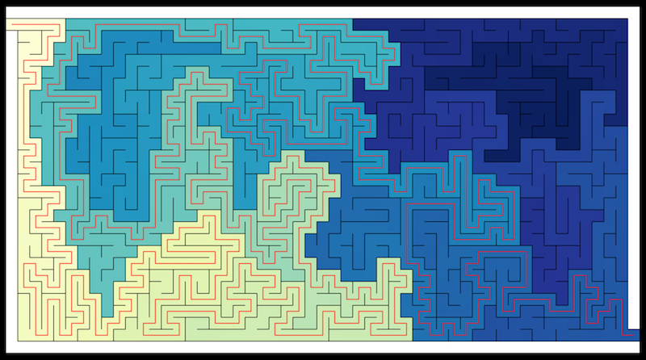

# A-Maze

**Maze Generation and solution algorithms visualized.**

## Frameworks

A-Maze uses React.js and Redux to manage user controls. It uses ES6 and functional programming techniques to handle graph and canvas rendering logic.

## Features

### Immutable graph array

All of the maze generation and solution algorithms are built in the following streaming structure.

```javascript
const step = (graph, start) => {
	// appropriate stepping logic

	return {
		step  : step(...),
		graph : newGraph,
		diff  : [...changedCells]
	}
}
```

This format allows you to take any worker function and run it through a recursive function that can accumulate as many steps of the graph as you like. With the following function I run any worker until every step has been taken and return a three dimensonal array (2 spatial, 1 temporal) that can later be iterated through and rendered.

```javascript
export default (worker, _graph) => {
	const runner = (stack, _step) => {
		if (_step === null) { return stack; }

		const _graph = stack[stack.length - 1];
		const { graph, step, diff } = _step(_graph);
		return runner([...stack, { graph, diff }], step);
	}

	const { graph, step, diff } = worker(_graph);
	return runner([{ graph, diff }], step);
}
```

**Notes:**
- There tail-call optimization has very little support in modern browsers, so in practice I acually use an imparitive approach that is functionally similar to avoid stack overflow errors.
- Cell diffs are returned and stored along with graphs to allow optimized rendering.
- Because of the immutable nature of the graphs a minimal amount of memory is used from one step to the next.

**Benefits**
- Total seperation of graph logic from timing logic.
- You know what step you are on as you move through the algorithm in relation to its end.
- Ability to traverse the algorithm in reverse or jump to any point in the algorithm at any time.

**Drawbacks**
- This frontloading of the generation becomes problematically long with larger graphs.
- Though memory usage is minimized, it can still become excessive with larger graphs.

You could avoid these drawbacks by either generating the graph as you need it and rendering it step by step. Or as I decided, keeping the graph resolution low enough that the performance issues don't arise.

### Graph Manipulation

The interface exposed for graph manipulation allows for simple modifications without mutating the graph. In the example below, a call to `setColor(graph, [0, 0], '#fff')` would return a new modified graph where the cell color at [0, 0] is now black. This is done by creating a newCell callback function and passing it into the `progressGraph()` function that passes it along to each pos asked for. To add flexability to the pos requested, the y and/or x coordinate can be set to null to and progress graph will apply the callback to every cell in the row and or coloumn provided.

```javascript
const progressGraph = (graph, pos, callback) => {
	const [x, y] = pos || [null, null];

	return graph.map((row, idx) => {
		if (x === null || idx === x) {
			return progressRow(row, y, callback);
		} else {
			return row;
		}
	});
}

const progressRow = (row, y, callback) => row.map((cell, idx) => {
	if (y === null || idx === y) {
		return callback(cell);
	} else {
		return cell;
	}
})

export const setColor = (graph, pos, color) => {
	const newCell = old => ({
		color : color,
		walls : old.walls,
		paths : old.paths,
		value : old.value
	});

	return progressGraph(graph, pos, newCell);
}
```

For more extensive modifications, there is also a wrapper for reducing a graph called series. Here the progress object is imported to contain all of the differant graph manipulation functions, such as setColor above.

```javascript
import * as progress from './progress';

export default (steps, initialGraph) => {
	const takeStep = (graph, step) => { 
		const [funcName, ...args] = step;
		return progress[funcName](graph, ...args);
	}

	return steps.reduce(takeStep, initialGraph);
}
```

This takes a two-dimensonal array where in the first element is the string literal of the function to be called and the remainder of elements are the arguments being provided to the function. An example of this in action is in the builder tool, that allows you to move from one cell, to another and remove the walls between them and set both of their colors to white as well.

```javascript
const newGraph = series([
	['removeWall', pos, dir],
	['removeWall', nextPos, back],
	['setColor', pos, color],
	['setColor', nextPos, color]
], graph);
```

With the series function now I can do four seperate operations on the graph without mutating an exising variable or instantiating 4 differant constant variables.

### Canvas Rendering

The rendering process starts with a basic function that takes a graph and diff array, and if the diff array is present, it renders each changed cell. This allows for constant scaleing of the rendering process when there are constant changes to the graph between steps and the steps are being iterated through one at a time. So therefore this process could render a single step of an indefinatly large graph in constant time, withholding other constraints.

The cell rendering process has some notable features, specifically the line drawing aspect. Any given cell has 8 differant lines that may be drawn on it. 4 walls, or 4 inner lines (from each side to the center). To do this there is first a function that will return the canvas coords of any requested point given a cell with a center point and a size.

```javascript
const returnPoint = cell => {
	const half = cell.size / 2;
	const pointDeltas = {
		topLeft     : [ -half, -half ],
		top         : [     0, -half ],
		topRight    : [  half, -half ],
		left        : [ -half,     0 ],
		center      : [     0,     0 ],
		right       : [  half,     0 ],
		bottomLeft  : [ -half,  half ],
		bottom      : [     0,  half ],
		bottomRight : [  half,  half ]
	}

	return point => {
		const [dx, dy] = pointDeltas[point];
		const [cx, cy] = cell.center;
		return [cx + dx, cy + dy];
	}
}
```

From there the cell rendering function defines each line as a set of two points each represented by string literals.

```javascript
const lines = {
	upWall    : [ 'topLeft', 'topRight' ],
	rightWall : [ 'topRight', 'bottomRight' ],
	downWall  : [ 'bottomRight', 'bottomLeft' ],
	leftWall  : [ 'bottomLeft', 'topLeft' ],
	upPath    : [ 'center', 'top' ],
	rightPath : [ 'center', 'right' ],
	downPath  : [ 'center', 'bottom' ],
	leftPath  : [ 'center', 'left' ]
}
```

Finally, in order to extract the points for being handed off to the canvas api, all you do is map the given lines object value with the returned function from returnPoint(). In all it looks like this.

```javascript
export const renderCell = context => {
	const lines = {
		upWall    : [ 'topLeft', 'topRight' ],
		rightWall : [ 'topRight', 'bottomRight' ],
		downWall  : [ 'bottomRight', 'bottomLeft' ],
		leftWall  : [ 'bottomLeft', 'topLeft' ],
		upPath    : [ 'center', 'top' ],
		rightPath : [ 'center', 'right' ],
		downPath  : [ 'center', 'bottom' ],
		leftPath  : [ 'center', 'left' ]
	}

	const drawLine = (to, from, color = 'black') => {
		context.beginPath();
		context.moveTo(...to);
		context.lineTo(...from);
		context.strokeStyle = color;
		context.stroke();
	}

	const fill = (color, topLeft, size) => {
		context.fillStyle = color;
		context.fillRect(...topLeft, size, size);
	}

	return cell => {
		const { size } = cell;
		const { walls, paths, color } = cell.data;
		const points = returnPoint(cell);

		fill(color, points('topLeft'), size);

		walls.forEach(dir => {
			const line = lines[dir + "Wall"].map(points);
			drawLine(...line);
		});

		paths.forEach(dir => {
			const line = lines[dir + "Path"].map(points);
			drawLine(...line, 'red');
		});
	}
}
```